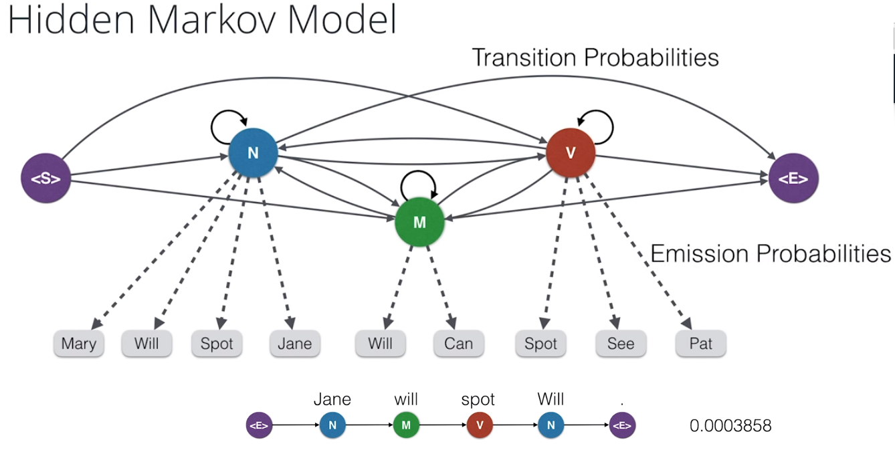

## Project Overview: Part of Speech Tagging with Hidden Markov Models

<p align="justify">Part of speech tagging is the process of determining the syntactic category of a word from the words in its surrounding context. It is often used to help disambiguate natural language phrases because it can be done quickly with high accuracy. Tagging can be used for many NLP tasks like determining correct pronunciation during speech synthesis (for example, dis-count as a noun vs dis-count as a verb), for information retrieval, and for word sense disambiguation.</p>

<p align="justify">In this notebook, we explore the Pomegranate API and use the Pomegranate library to build a hidden Markov model for part of speech tagging using a "universal" tagset. Hidden Markov models have been able to achieve >96% tag accuracy with larger tagsets on realistic text corpora. Hidden Markov models have also been used for speech recognition and speech generation, machine translation, gene recognition for bioinformatics, and human gesture recognition for computer vision, and more.</p>



The Road Ahead
* Step 0: Build a Simple HMM model and explore the Pomegranate library
* Step 1: Review the provided interface to load and access the text corpus
* Step 2: Build a Most Frequent Class tagger to use as a baseline
* Step 3: Build an HMM Part of Speech tagger and compare to the MFC baseline
* Step 4: (Optional) Improve the HMM tagger

### Results

training accuracy basic hmm model: 97.54%

testing accuracy basic hmm model: 95.96%

## Setting up

create conda environment with required packages: ```conda env create -f hmm-tagger.yaml```


Launch Jupyter notebook, navigate to the two notebooks in the repo & complete them.```$ jupyter notebook```
